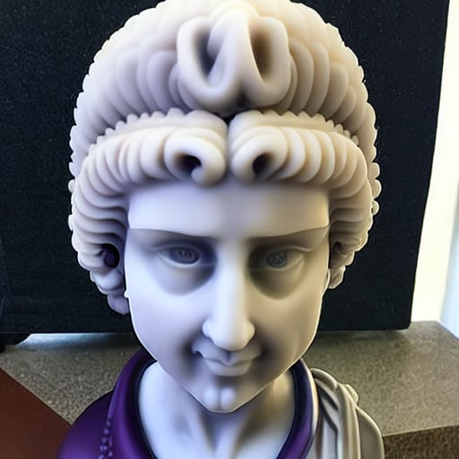
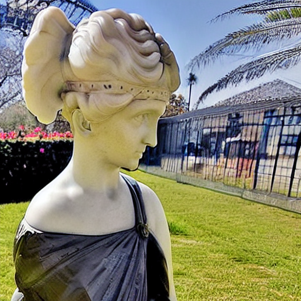
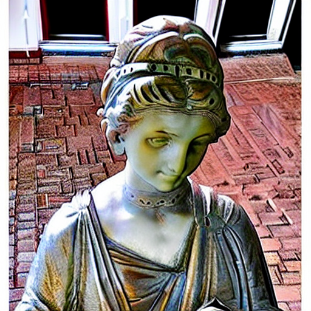
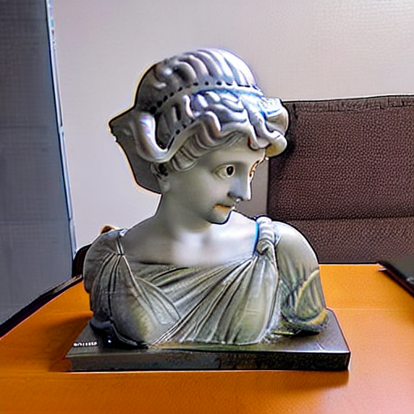
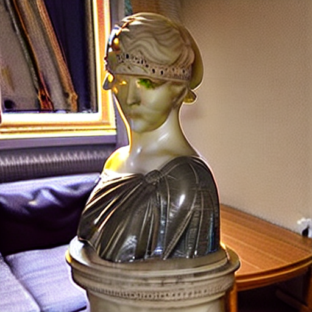
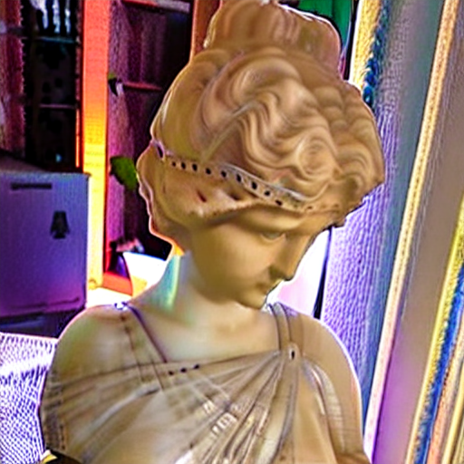

# Raport Projektowy

## 1. Opis Koncepcji (1 pkt)
Posiadam w domu rzeźbę po Cioci o imieniu Licia chciałbym dodać ją do modelu "sd-legacy/stable-diffusion-v1-5". 

---

## 2. Przygotowanie Danych (5 pkt) 
{/* Wypełnij tę sekcję tylko, jeśli używasz własnego zbioru danych */}

Opis procesu przygotowania danych:
1.  **Pozyskiwanie**: Zrobiłem zdjęcia moim telefonem, w rónych configuracjach, z rónych kierunków, w rónym oświetleniu i z rónym tłem. 
2.  **Preprocessing**: Zdjęcia przetworzyłem do formatu 1024x1024 z uyciem webowego nazedzia  https://www.birme.net/
3. **Opis**: Kezde zdjęcie opisałem podkrteślając elementy które nie są samą licja aby nauczyc model odrózniać nowy koncept od tła.

---

## 3. Metody uczenia (9 pkt)

### 3.1. Textual Invertion

Ta technika pozostawia bardzo wiele do zyczenia najlepszy obrazek jaki byłem wstanie z niej wyciagnac to: 

w dodatku czas uczenia był olbrzymi w porównaiu z DreamBooth i odrobine dłuzszy ni LoRA

### 3.2. DreamBooth

Ta technika okazała się przynosić bardzo zadowalające rezultaty:

czas uczenia nie był bardzo długi a wygenerowany obrazek zawiera cechy charakterystyczne dla licji jak opaska we wlosach czy szara toga

### 3.3. LoRA

To jedyna technika dla której zastosowałem opisy zdjęć i niestety wyniki nie sa szczególnie dobre: 

powysze zdjęcie to najlepsze co udało mi się wygenerować

---

## 4. Eksperymenty (15 pkt)

### Experyment 1: 
Jako experyment postanowiłem spróbować techniki dreambooth lora, która obiecuje nawet bardziej przyspieszyć proces uczenia się nowego konceptu.

Rezulaty okazały się mieszane, owszem przy takiej samej liczbie kroków co w przypadku kazdej innej techniki (uywałem 1000 kroków) była niesamowicie szybka i skończyła trening w około 10 min,
jednak wygenerowane obrazki mozna tylko z duzym wysiłkiem zakwalifikować jako licie: 

### Experyment 2: 

Ze względu na obiecującą prętkość uczenia z uyciem techniki techniki dreambooth lora postanowiłem spróbowac zastosować tą technikę z większym batch size: 2 (oryginalnie we wszystkich treningach uzywałem 1)
oraz większą ilością kroków: 2000

Rezultaty okazały się przypominać licje bardziej, ale są dziwnie "halucynogenne" w dodatku wydaje się zę model nauczył się elementów tła z mojego data setu pomimu wielu próbek które ich nie zawierają:

## Notatki końcowe:

W tym repozytorium znajduje się większość mojej pracy w pliku `code.ipynb` jest cały kod którego uzyłem. w katalogu `Licia` są moje dane treningowe. I są te wagi dla technik dla których umiałem je załączyć niestety niektóre były tak duze (dreambooth) ze postanowiłem ich nie załączać mam je zapisane na [dysku google](https://drive.google.com/file/d/1Um0VZ9VDjpsEwpWmmHEF-eW6TBaaznD2/view?usp=sharing) i mzna je z tamtąd pobrać.