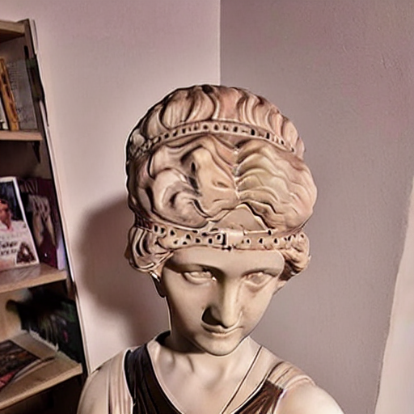
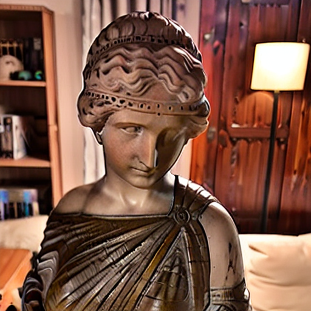
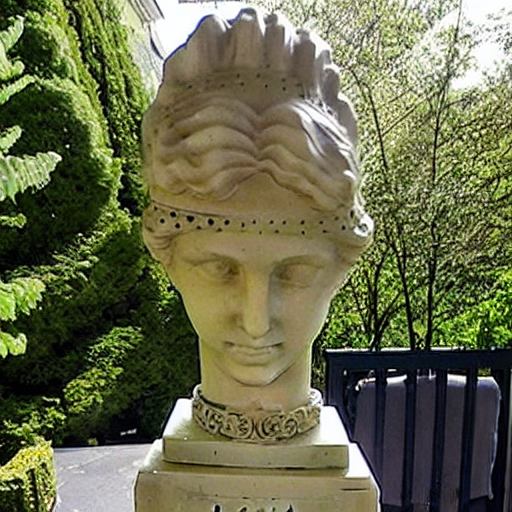
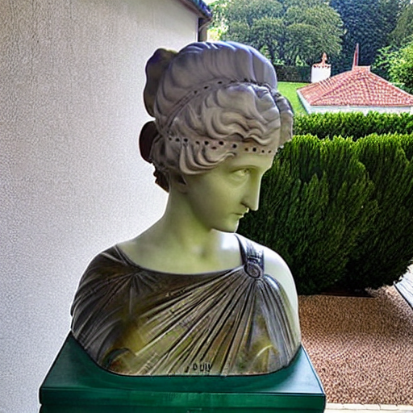
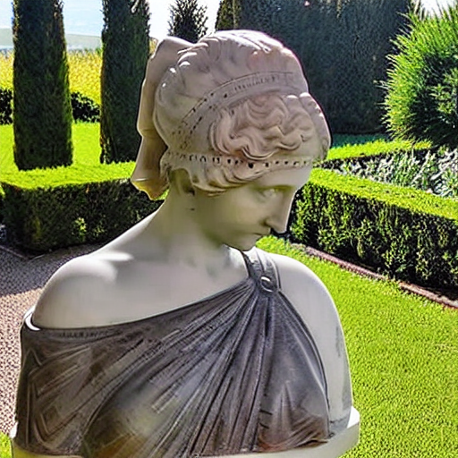
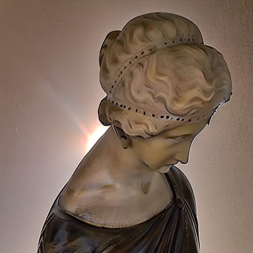
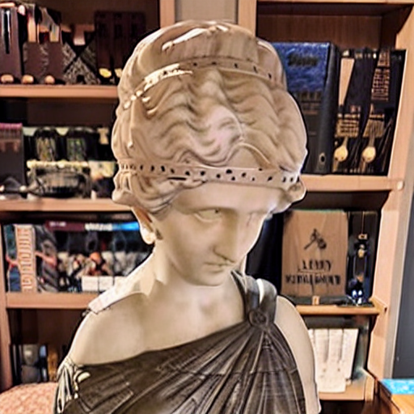
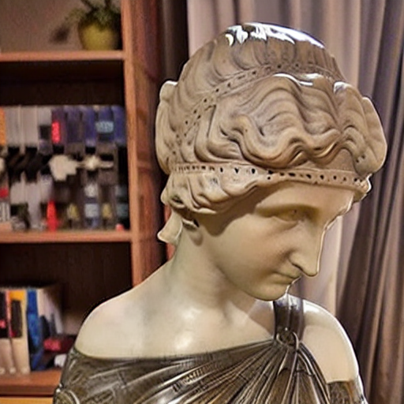
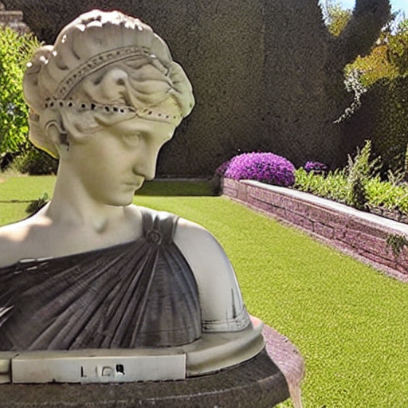
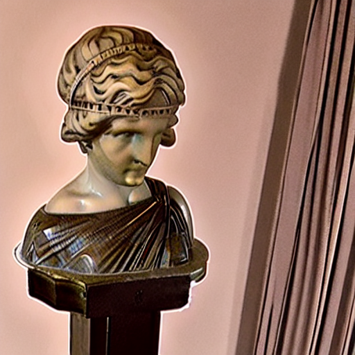

# Raport Projektowy - Extra Experymenty

## Wstęp:

W głównej części mojego projektu, uczyłem model `sd-legacy/stable-diffusion-v1-5` koceptu rzeźby którą mam w domu: 

W mojej opini najlepszy rezultat odniosłem uywająć techniki `dreambooth`: 

Dlatego w moich experymentach dodatkowych będe skupiał się włanie na tej technice.

## Experyment 1 (Mniejsza ilość danych treningowych):

W tym experymencie chciałem zobaczyć co stanie się jezeli uzyję mniej zdjęć licji. 

### Próba 1 (tylko frontowe zdjęcia):

W pierwszej próbie usunąłem z oryginalnego datasetu wszystkie zdjęcia z profilu
i pozostawiłem tylko 8 takich które przedstawiają rzeźbę od frontu. Efekty były częściowo zadowalające poniwaz
nowy model był wstanie wygenerować licię niestety, generował równiez tło zawarte w training secie (jak regał lub załony w moim salonie):

  
  

Aby przetestować czy koncept Licji jest generalizowalny przez model poza środowiskiem w którym zostały zrobione zdjęcia spróbowąłem promptu: `A photo of <Licia> statue in a garden` próbując wymusić scenarie porównywalną z oryginalnym rezultatem, niestety najlepszy rezultat jaki udało mi się osiągnąć jest następujący: 

### Próba 1 (Zdjęcia z rónych perspektyw):

W drugej próbie równiez uzyłem tylko 8 zdjęć ale tym razem z wielu perspektyw. Rezultaty gdy uzyłem promptu `A photo of <Licia> statue in a garden` były następujące: 

  
  

Uwazam je za bardzo dobre, być moze nawet lepsze niz oryginalnego modelu. Niestety zdjecia wygenrowane bez kontekstu zdają się zapamietywać moją ścianę: 

## Experyment 2 (rózne parametry uczenia):

W tym experymencie chciałem przeanalizowac czy da się poprawić rezulaty dreambooth,
zwiększając liczbę kroków treningowych lub rozmiar batcha. 

### Większa ilość kroków: 

Zwiększenie liczby kroków do 2000 z oryginalnego 1000 spowodowało ze zdjęcia wygenerowane bez dodatkowej istrukcji zawierały wiele detali tła zdjęć treningowych: 

  
  

Jednak zdjęcia wygenerowane z uyćiem juz standardowego promptu `A photo of <Licia> statue in a garden` są jednymi z najlepszych rezultatów jakie uzyskałem:

Co sugeruje ze uzcie wiekszej liczby kroków jest kozystne. 

### Większy rozmiar batcha: 

Niestety zwiększenie rozmiaru batcha nie przyniosło dobrych rezultatów, nowy model miał problemy z jakimkolwiek wygenerowaniem licji i najlepszy rezultat jaki udało mi się osiągnąć jest następujący: 

